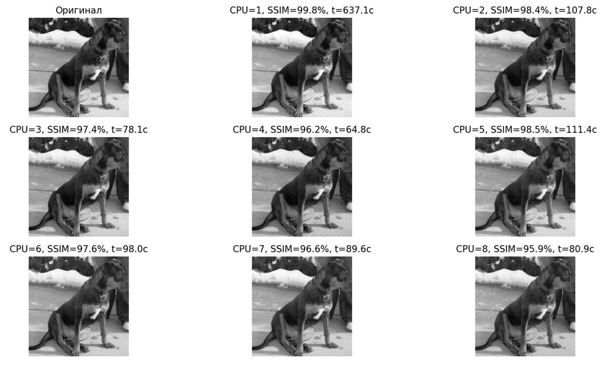
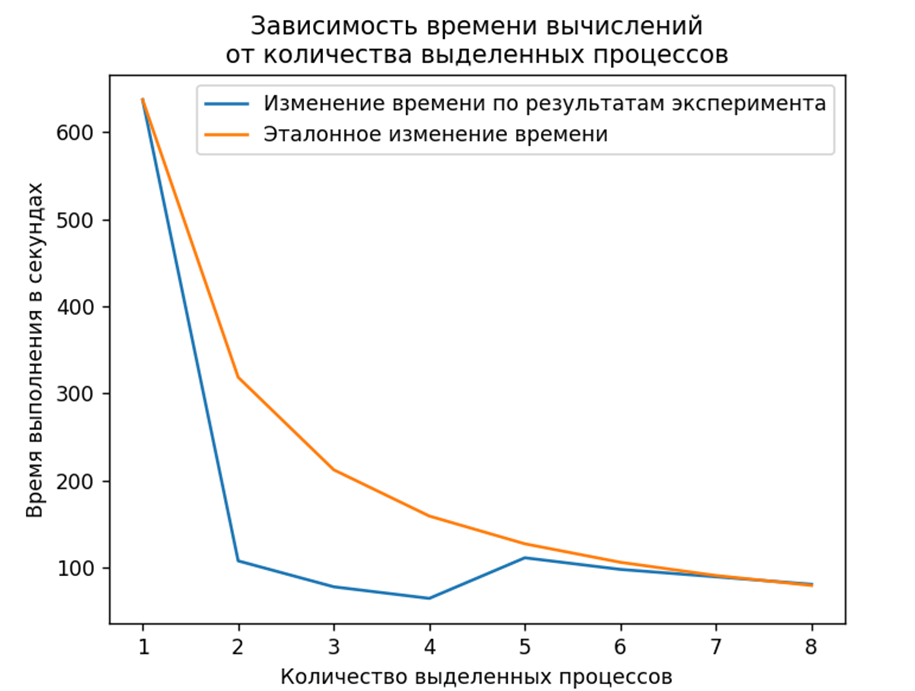

# image_reconstruction

## Восстановление исходного изображения в градациях серого с помощью восстановления распределений в координатах, соответствующих пикселям.

Для решения данной задачи генерируется N агентов и помещаются в случайные координаты нулевой матрицы, по размерам аналогичной исходному изображению.
За каждое посещение агентом (включая первоначальное помещение) какой-либо координаты, значение в ней увеличивается на 1.
Каждый агент перемещается в одну из соседних координат, в которой разница между распределением для исходного изображения и распределением в матрице агентов максимальна.
Агенты перемещаются до тех пор пока индекс структурного сходства (SSIM) изображений не достигнет заданной точности или пока не перестанет увеличиваться.

## Multiprocessing

Задача разбивается на процессы, каждый из которых выполняет указанные выше действия.
Раз в заданное количество итераций значения в точках матриц, полученных из процессов усредняются.
Процессам передается обновленная матрица и сохраненные последние координаты агентов для каждого процесса.

## Анализ

Также представляется зависимость скорости выполнения алгоритма при использовании разного числа процессов, которая сопоставляется с эталонной.
За эталон выбрано время, которое изменяется обратно пропорционально изменению числа процессов, где начальное время – то, для которого был выделен единственный процесс.

